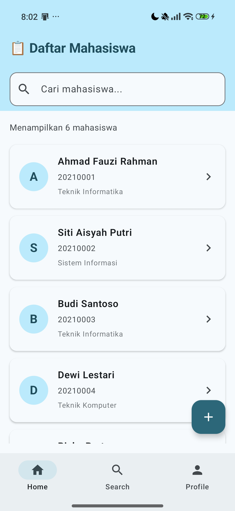
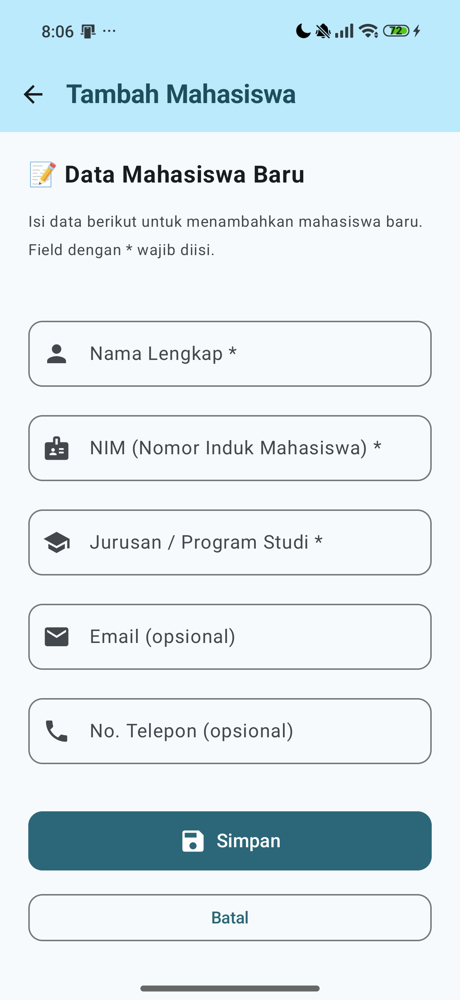
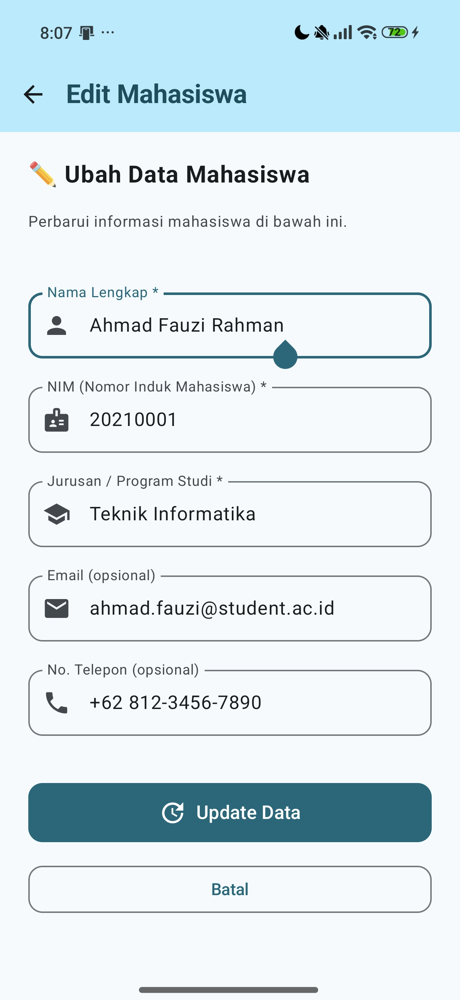
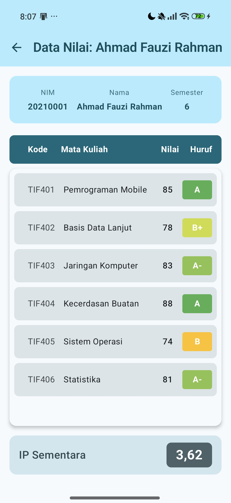
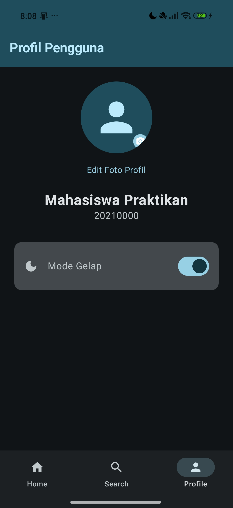
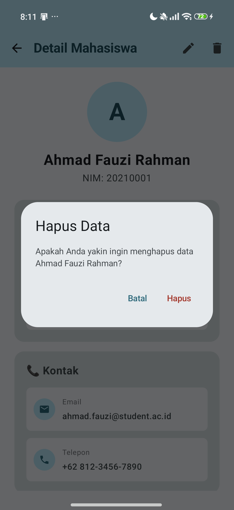

# 📱 Week 3 - State Management & Navigation
## Praktikum: Aplikasi Daftar Mahasiswa

---

## 👤 Informasi Mahasiswa
- **Nama:** Willy Rafael F.S.
- **NIM:** 23083000168
- **Mata Kuliah:** Pemrograman Mobile
- **Instansi:** Universitas Merdeka Malang

---

## 🚀 Tentang Proyek
Proyek ini adalah aplikasi Android berbasis **Jetpack Compose** yang dirancang untuk mengelola data mahasiswa. Aplikasi ini mendemonstrasikan implementasi **State Management**, **Navigation**, dan pola **State Hoisting** yang modern.

### ✨ Fitur Utama (Tugas Mandiri):
1.  **CRUD Lengkap (Memory-based):**
    - Tambah mahasiswa baru.
    - Lihat detail informasi mahasiswa.
    - Edit data mahasiswa yang sudah ada.
    - Hapus data mahasiswa (dengan dialog konfirmasi).
2.  **Navigasi Modern:**
    - Menggunakan **Navigation Component Compose**.
    - **Bottom Navigation Bar** untuk akses cepat ke Home, Search, dan Profile.
3.  **Pencarian Efisien:**
    - Fitur filter/search di halaman utama untuk mencari mahasiswa berdasarkan nama atau NIM secara real-time.
4.  **Data Akademik:**
    - Halaman **Data Nilai** untuk melihat transkrip nilai sementara dan perhitungan IP otomatis.
5.  **Personalisasi & State:**
    - **Dark Mode Toggle** yang statusnya tetap terjaga meskipun layar dirotasi (menggunakan `rememberSaveable`).
    - Fitur **Edit Foto Profil** (Simulasi pemilihan gambar dari galeri).

---

## 📸 Screenshots
Berikut adalah tampilan antarmuka dari aplikasi Daftar Mahasiswa:

| Home Screen | Search Feature | Add Student | Detail Mahasiswa |
| :---: | :---: | :---: | :---: |
|  |  |  |  |
| *Daftar mahasiswa utama.* | *Fitur pencarian real-time.* | *Form tambah mahasiswa.* | *Informasi detail lengkap.* |

| Edit Data | Data Nilai | Profile & Dark Mode | Edit Foto Profil |
| :---: | :---: | :---: | :---: |
|  |  |  |  |
| *Form edit informasi.* | *Transkrip & IP otomatis.* | *Profil & toggle tema.* | *Simulasi ganti foto.* |

| Hapus Data |
| :---: |
|  |
| *Dialog konfirmasi untuk menghapus data mahasiswa.* |

---

---

## 🛠️ Struktur Project

```
Week3_DaftarMahasiswa/
├── app/src/main/java/com/example/daftarmahasiswa/
│   ├── MainActivity.kt                ← Entry point & Dark Mode State
│   ├── data/
│   │   └── Student.kt                 ← Model data & Logic CRUD
│   ├── navigation/
│   │   └── AppNavigation.kt           ← Pusat Navigasi & Bottom Bar
│   └── screens/
│       ├── HomeScreen.kt              ← Daftar & Search Mahasiswa
│       ├── DetailScreen.kt            ← Info Lengkap & Konfirmasi Hapus
│       ├── AddStudentScreen.kt        ← Form Tambah Mahasiswa
│       ├── EditStudentScreen.kt       ← Form Edit Mahasiswa
│       ├── DataNilai.kt               ← Tampilan Nilai & IP
│       ├── ProfileScreen.kt           ← Pengaturan Profil & Tema
│       └── ProfileEditPhotoScreen.kt  ← Simulasi Ganti Foto Profil
├── screenshots/                       ← Folder dokumentasi gambar
└── ...
```

---

## 🔑 Konsep Kunci yang Digunakan

### 1. State Management (`rememberSaveable`)
Digunakan pada form input dan pengaturan tema agar data tidak hilang saat terjadi perubahan konfigurasi (seperti rotasi layar).

### 2. State Hoisting
Logika data (List of Students) diangkat ke level `AppNavigation` agar perubahan data di satu layar (misal: Edit atau Tambah) langsung tercermin di layar lainnya (Home).

### 3. Navigation Compose
Perpindahan antar halaman menggunakan route string dan pengiriman parameter (seperti `studentId`) antar layar dengan aman.

---

## 📥 Cara Menjalankan (Clone Project)

1.  **Clone repositori ini:**
    ```bash
    git clone https://github.com/willyrafaelfs/Pemrograman-Mobile-Daftar-Mahasiswa.git
    ```
2.  **Buka di Android Studio:**
    - Pilih **File > Open**.
    - Arahkan ke folder `Week3_DaftarMahasiswa`.
3.  **Tunggu Gradle Sync:**
    Pastikan koneksi internet stabil untuk mendownload dependency.
4.  **Jalankan Aplikasi:**
    Klik tombol **Run (▶)** atau tekan `Shift + F10`.

---

## Referensi
- [Official Jetpack Compose Documentation](https://developer.android.com/jetpack/compose)
- [Navigation in Compose](https://developer.android.com/jetpack/compose/navigation)
